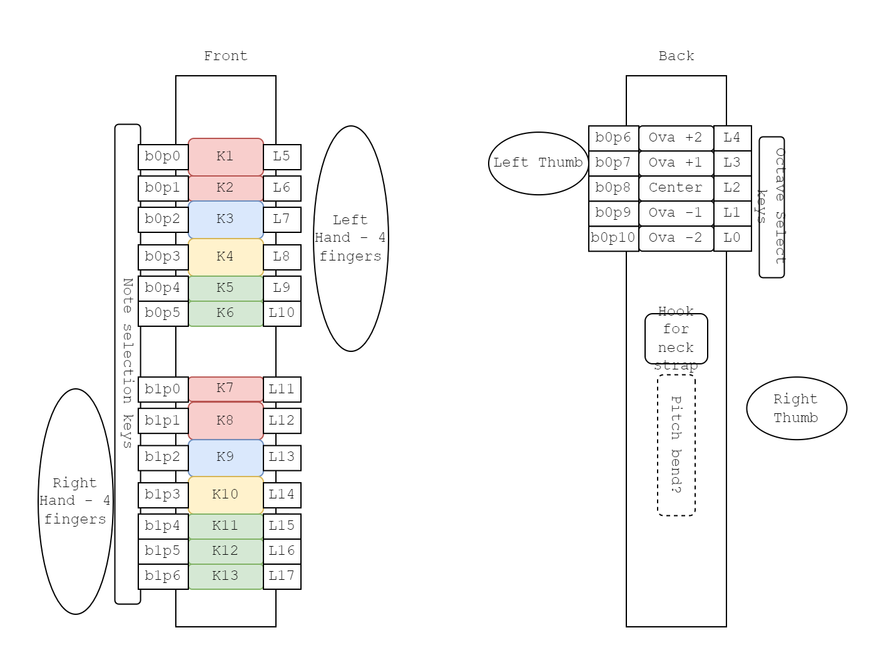

# Notes

## Prior Art

### Akai EWI

[Akai store page](https://www.akaipro.com/products/ewi-series)

This is the commercial product. The thing people will compare to this.

### MiniWI by @Trasselfrisyr

[Link to Hackaday post](https://hackaday.io/project/11843-miniwi-woodwind-midi-controller)

This one is really nice because it has conductive copper pads instead of physical buttons you press.

### Haxophone by @cardonabits

[Link to github page](https://github.com/cardonabits/haxo-hw)

Good modern hardware design. Uses some good practices for raspi and uses fluidsynth as the synth engine.

Don't like the usage of mechanical keyboard switches, even if it looks very clean and makes for an easy PCB design. Does not seem ergonomic.

### Various Wind Controllers by Gordon Good

[Link to project homepage](http://gordophone.blogspot.com/2013/01/a-series-basics-of-diy-wind-controllers.html) | [Link to woodwind controller build blog](http://gordophone.blogspot.com/2016/04/aside-touch-sensing-with-mpr121.html)

Has some really good discussions on a lot of these topics. Talks about the difficulty of emulating non-ADSR synthesizers.

Also fun fact, he lives in Palo Alto, and has done workshops at CCRMA! We could reasonably hang out with this guy, if we wanted.

### The guy who invented the EWI

[Nyle Steiner Homepage](https://www.patchmanmusic.com/NyleSteinerHomepage.html)

Seems interesting.

## Requirements

These are the driving requirements for our build.

1. IDK

## Necessary components

## Other Notes

- More octaves is good...EWI has 7 octaves and players love to mess around with it.
    - Also should be easy to switch between them, EWI has thumb roller
- EWI can also bite the mouthpiece as a CC
    - No bite sensor means we could swap out mouthpieces easily though.
- Need a hook on back for neck strap
- Airspeed is volume, basically.
